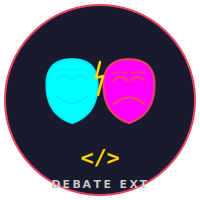

<p align="center">
  
</p>

# DEBATE EXT v1.0

> **debate_ext v1.0** — Multi-agent code generation & evaluation framework

AI debate orchestrator — Claude + OpenAI collaborate via API keys to produce robust code.
Includes a paper-grade benchmark suite that evaluates inter-LLM collaboration quality.

## Architecture

```
debate_ext/
  vscode-extension/    ← VS Code extension (TypeScript)
    src/               ← Extension source + benchmark suites
    scripts/           ← smoke.js, setup_mbppplus.py
    data/              ← MbppPlus.jsonl (378 MBPP+ tasks)
  tools/               ← Python auxiliary scripts
  scripts/             ← Root-level scripts
```

### Extension (VS Code sidebar)

Claude (Anthropic API) and GPT (OpenAI API) collaborate in a debate loop
to generate, review, and refine code changes. The extension auto-detects
task complexity and adapts the debate depth accordingly.

### Paper-Grade Benchmark (`benchmark_paper.ts`)

A rigorous evaluation framework comparing 8 collaboration configurations
on MBPP+ (378 Python tasks from EvalPlus). Designed for reproducible
research with full audit trails.

#### Generators

Mid-tier models via Ollama Cloud — chosen to reveal collaboration effects
(frontier models saturate easy benchmarks):

| Alias | Model | Provider |
|-------|-------|----------|
| QC | Qwen3-Coder 480B | Ollama Cloud |
| MM | MiniMax M2 | Ollama Cloud |

#### 8 Collaboration Configurations

| Config | Short | Description |
|--------|-------|-------------|
| `gen1-solo` | QC.Solo | Qwen3-Coder generates alone (baseline) |
| `gen2-solo` | MM.Solo | MiniMax M2 generates alone (baseline) |
| `gen1-lead` | QC.Lead | Qwen3 leads, MiniMax assists |
| `gen2-lead` | MM.Lead | MiniMax leads, Qwen3 assists |
| `gen1-orch` | QC.Orch | Qwen3 orchestrates (reviewer), MiniMax codes |
| `gen2-orch` | MM.Orch | MiniMax orchestrates (reviewer), Qwen3 codes |
| `gen1-selfrefine` | QC.SRef | Qwen3 generates then self-reviews (up to N iterations) |
| `gen2-selfrefine` | MM.SRef | MiniMax generates then self-reviews (up to N iterations) |

#### 3-Level Judge Evaluation

Three frontier judges from **three distinct providers** — zero conflict of interest:

| Role | Model | Provider |
|------|-------|----------|
| Judge 1 | Claude Sonnet 4.5 | Anthropic API |
| Judge 2 | GPT-4.1 | OpenAI API |
| Tie-breaker | Gemini 2.5 Pro | Google AI API |

##### Evaluation Protocol

Each task evaluation follows a 3-level escalation:

```
R1: Both judges score ALL candidates independently (blind, shuffled labels)
    Criteria: correctness, completeness, edgeCases, codeQuality, readability
    + holistic total (1-10) + risk_fail_prob (0.0-1.0)
                    |
                    v
    DIVERGENCE CHECK (two triggers):
      (a) |total_judge1 - total_judge2| > tau   (default tau = 2.0)
      (b) risk_fail_prob on opposite sides of 0.5
    If no divergence → DONE. Final = average of R1 scores.
                    |
                    v
R2: DEBATE. Both judges see each other's R1 scores + justifications
    for the divergent candidates only. They re-score considering
    the other judge's arguments.
    If convergence → DONE. Final = average of merged scores.
                    |
                    v
TB: TIE-BREAKER. Gemini receives the original R1 prompt (blind).
    It scores ALL candidates as an independent 3rd judge.
    Final = 3-way average.
```

Every evaluation produces a full `judgeAudit` with three score snapshots:
- `j0` — R1 baseline average
- `j1` — post-debate average (R2 replaces R1 for divergent labels)
- `j2` — final average (includes tiebreaker if used)

#### Safety Features

- **Checkpoint/resume**: saves after each task, resume with `--resume`
- **Circuit-breaker**: 3 consecutive judge API failures → save + exit(2), retryable on resume
- **Streaming output**: real-time display of LLM generation with ANSI colors per agent
- **Think detection**: dims `<think>`/`<thinking>` blocks, bolds code blocks


#### Code Execution Warning

Generated code is executed directly via `python3 -c` on the host machine.
**No sandboxing is applied** (no Docker, firejail, or cgroup limits).

For MBPP+ tasks (pure functions with assert-based tests), the risk is minimal.
However, for safety:
- Run benchmarks in a dedicated VM or container
- Do not run with elevated privileges
- Review generated code samples if running on sensitive systems

A `--sandbox docker` option is planned for a future release.

#### Paper Metrics

The final report includes:

| Metric | Description |
|--------|-------------|
| pass@1, pass@k | Chen et al. unbiased estimator, base + EvalPlus+ tests |
| Variance | stddev of pass@1 across tasks per config |
| Inter-judge agreement | Spearman correlation + Cohen's kappa (R1) |
| Escalation stats | debates triggered, tiebreaker usage, avg score shift |
| McNemar test | paired significance (solo vs. collab) |
| Cost-efficiency | API calls per config, quality-per-call, pass-per-call |
| Token usage | per-provider prompt/completion/total tokens |

## Prerequisites

- **Node.js** >= 18 and **npm**
- **Python 3** with `evalplus` package (for MBPP+ data)
- **Ollama** with cloud models (or local models)

## Environment Variables

| Variable | Required for | Description |
|----------|-------------|-------------|
| `ANTHROPIC_API_KEY` | Extension + Benchmarks | Anthropic API key |
| `OPENAI_API_KEY` | Extension + Benchmarks | OpenAI API key |
| `GEMINI_API_KEY` | Benchmarks (tie-breaker) | Google AI API key |
| `OLLAMA_HOST` | Benchmarks | Ollama host (default: host.docker.internal) |
| `OLLAMA_PORT` | Benchmarks | Ollama port (default: 11434) |

API keys for the extension are stored securely via VS Code SecretStorage.
Benchmark keys are read from environment variables only.

## Quick Start

### Extension Development

```bash
cd vscode-extension
npm install
npm run watch    # auto-compile on save
# Press F5 in VS Code to launch Extension Development Host
```

### Setup MBPP+ Data

```bash
cd vscode-extension
python3 -m venv .venv && source .venv/bin/activate
pip install evalplus
python3 scripts/setup_mbppplus.py    # creates data/MbppPlus.jsonl (378 tasks)
```

### Run Paper Benchmark

```bash
cd vscode-extension
npm run compile

# See all options
node out/benchmark_paper.js --help

# Dry-run (mock scores, no API calls)
node out/benchmark_paper.js --dry-run --limit 5

# Full run (378 tasks, 3 runs, all 8 configs)
node out/benchmark_paper.js --limit 378 --runs 3

# Resume after interruption
node out/benchmark_paper.js --limit 378 --runs 3 --resume

# Run specific tasks only
node out/benchmark_paper.js --tasks Mbpp/2,Mbpp/3 --runs 1

# Skip first N tasks
node out/benchmark_paper.js --limit 378 --runs 3 --offset 100

# Ablation: disable debate (R1 scores only)
node out/benchmark_paper.js --limit 378 --runs 3 --no-debate

# Ablation: informed judges (show exec status)
node out/benchmark_paper.js --limit 378 --runs 3 --judge-informed
```

### Post-Processing

```bash
# Re-judge with different settings (e.g., different tau)
node out/benchmark_paper.js --rejudge-from benchmark-results/report.json --judge-threshold 3.0

# Merge results from multiple runs
node out/benchmark_paper.js --merge benchmark-results/run1.json,benchmark-results/run2.json
```

### Smoke Tests

```bash
npm run smoke    # checks build artifacts, --help, security patterns, MbppPlus.jsonl
```

## Output

Results are saved to `benchmark-results/`:

| File | Content |
|------|---------|
| `checkpoint_paper.json` | In-progress checkpoint (auto-saved after each task) |
| `bench_paper_<timestamp>.json` | Final report with all metrics |

The final JSON report contains:
- `meta` — full experiment configuration (models, seed, tau, flags)
- `tasks[]` — per-task results with generated code, exec status, judge audit
- `summary` — pass@1, quality scores, cost-efficiency, paper metrics

## VS Code Commands

| Command | Description |
|---------|-------------|
| `DEBATE EXT: Run Debate` | Auto-detect mode and run debate |
| `DEBATE EXT: Run Simple` | Force simple mode (single pass) |
| `DEBATE EXT: Run Complex` | Force complex mode (full debate) |
| `DEBATE EXT: Stop Debate` | Stop the current debate |
| `DEBATE EXT: Clear Chat` | Clear chat history |
| `DEBATE EXT: Configuration` | Configure models and settings |

## Security

- Zero API keys in source code — enforced by smoke tests
- Extension keys stored via VS Code SecretStorage (OS keychain)
- Benchmark keys via environment variables only
- `.env` excluded by `.gitignore`
